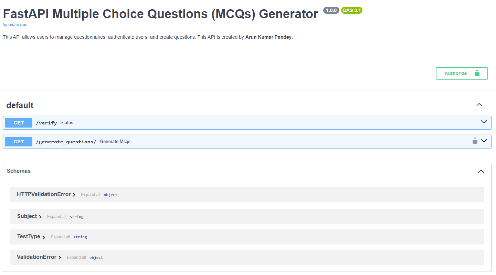

# Project Title: FastAPI MCQ Generator with Authentication and Admin Features

[Project Github repository](https://github.com/arunp77/Data-engineering-tools/tree/main/Fastapi)

## Overview:
This project aims to create a FastAPI application to generate Multiple Choice Questions (MCQs) via a smartphone or web browser application. The API allows users to select test types, categories, and the number of questions to receive randomized MCQs. Additionally, the API supports basic authentication for user verification and admin features for question management.

## Project directory structure

```bash
project_folder/
│
├── api/                    # Contains modules related to API functionality
│   ├── __init__.py         # Python package initialization file
│   ├── auth.py             # Module for authentication logic
│   ├── endpoints.py        # Module defining API endpoints
│   ├── models.py           # Module defining Pydantic models for data validation
│   └── utils.py            # Utility functions used across the API
│
├── data/                   # Directory for storing data files
│   └── questions_en.xlsx   # Excel file containing question data
│
├── tests/                  # Directory for API test scripts
│   └── test_api.py         # Python script containing test cases for the API
│
├── main.py                 # Main application file
└── requirements.txt        # File listing Python dependencies for the project
```

## Files and description:


## Features:

- **Authentication:** Secure authentication mechanism using Basic Authentication, ensuring authorized access to the API endpoints.
- **Question Generation:** Dynamically generate MCQs based on specified test types (`use`) and categories (`subject`), with options to choose the number of questions per set.
- **Randomization:** Questions are returned in a randomized order, providing variability and preventing predictability in question sets.
- **Error Handling:** Robust error handling mechanisms to gracefully handle invalid requests and authentication failures.
  1. **Authentication Error Handling (`auth.py`):**
     - In the `authenticate` function, if the provided username or password is incorrect, an `HTTPException` is raised with a status code of `HTTP_401_UNAUTHORIZED`. This indicates an authentication failure.
     - The raised exception includes a detailed message indicating that the username or password is incorrect.
   2. **Endpoint Error Handling (`endpoints.py`):**
        - Error handling is implemented within each endpoint function to handle potential errors gracefully.
        - For example, in the `generate_mcqs` endpoint, if any error occurs during the generation of MCQs, an appropriate exception can be raised to notify the client about the issue.
   3. **Global Error Handling (`main.py`):** provides built-in support for global error handling through middleware. Custom middleware or exception handlers can be added to handle errors that occur at the application level, such as uncaught exceptions or validation errors.
        - Two exception handler middleware functions are defined: `http_exception_handler` and `generic_exception_handler`.
        - `http_exception_handler` handles `HTTPExceptions` raised by FastAPI, which are typically used to return specific HTTP status codes and error messages.
        - `generic_exception_handler` catches any other exceptions that may occur and returns a generic internal server error message with a status code of 500.
        - Both middleware functions receive the request and the exception object as parameters and return a JSONResponse with the appropriate status code and error message.
- **User Authentication:** Endpoint to verify the functionality and availability of the API. Basic authentication is implemented to verify user credentials. Users must provide a valid username and password to access the API e FastAPIndpoints.
- **Admin Features**: Admin users with the password "4dm1N" can create new questions via a dedicated endpoint. This ensures seamless management of the question database.
- **API Documentation:** Interactive documentation powered by **Swagger UI**, providing detailed information on available endpoints and request parameters.

## Endpoints:
The `endpoints.py` module defines various endpoints for the API, allowing users to interact with the application to perform different tasks related to managing questionnaires and generating questions.

1. `/verify` Endpoint:
   - Description: This endpoint verifies that the API is functional. It serves as a health check to ensure that the API is up and running.
   - Method: GET
   - Function: `verify_api()`
   - Response: Returns a JSON object with a status message indicating that the API is functional.

2. `/generate_questions/` Endpoint:
   - Description: This endpoint generates multiple-choice questions based on specified parameters such as test type, subject, and the number of questions.
   - Method: GET
   - Function: `generate_mcqs()`
   - Parameters:
     - `test_type`: Specifies the type of test (e.g., Positioning test, Validation test, Total Boot Camp).
     - `subject`: Specifies the subject/category for the questions (e.g., Databases, Distributed systems, Data Streaming).
     - `num_questions`: Specifies the number of questions to generate.
   - Authentication: Basic authentication is required using username and password.
   - Error Handling: Implements robust error handling to gracefully handle invalid requests and authentication failures.
   - Response: Returns a JSON object containing the generated multiple-choice questions.

These endpoints provide users with the ability to verify the functionality of the API and generate questions dynamically based on their requirements, facilitating the management of questionnaires within the application.



## Setup:
1. **Clone the repository from GitHub:** `git clone https://github.com/arunp77/FastApi-userdatabase.git`
2. **Install dependencies from requirements.txt:** `pip install -r requirements.txt`
3. **Run the FastAPI application:** `uvicorn main:app --reload`

## Usage:
1. Generate MCQs:
   - Send a POST request to `/generate_questions` with the following parameters:
     - `use`: Test type (e.g., "Positioning test", "Validation test", "Total Boot Camp")
     - `categories`: List of categories (e.g., "Databases", "Machine Learning")
     - `num_questions`: Number of questions to generate
   - Include authentication credentials in the request headers (`Authorization: Basic <username:password>`).
2. Authenticate User:
   - Send a POST request to `/authenticate` with the following parameters:
     - `username`: User's username
     - `password`: User's password
3. Create New Question (Admin Only):
   - Send a POST request to `/create_question` with the new question details.
   - Include admin credentials in the request headers (`Authorization: Basic admin:4dm1N`).

## Testing:
- Detailed instructions for testing the API can be found in the provided test_commands.txt file.

### Deployment:
The Questionnaire API can be deployed on any compatible server environment using tools like Uvicorn or ASGI servers. It's recommended to deploy the API in a secure environment with proper authentication mechanisms to control access.

## Architecture Choices:
- FastAPI chosen for its simplicity, performance, and automatic interactive documentation.
- Pandas utilized for efficient data manipulation and handling of the question dataset.
- Basic authentication implemented for user verification, with credentials securely passed in the request headers.
- Endpoints designed to be intuitive and RESTful for ease of use.
- Python's random module used for shuffling questions to ensure randomization.

## Contributing:
Contributions to the project are welcome! Please fork the repository, make your changes, and submit a pull request with a detailed description of the proposed changes.

## License:
This project is licensed under the MIT License. See the LICENSE file for details.

## Acknowledgements:
- Special thanks to the FastAPI community for their excellent documentation and support.
- Thanks to the contributors who have helped improve this project.

## Contact:
For inquiries or feedback, please contact [arunp77@gmail.com](mailto:arunp77@gmail.com).

## References:
- FastAPI Documentation: [https://fastapi.tiangolo.com/](https://fastapi.tiangolo.com/)
- Pandas Documentation: [https://pandas.pydata.org/docs/](https://pandas.pydata.org/docs/)

## Author:
[Arun Kumar Pandey] - [GitHub Profile](https://github.com/arunp77)