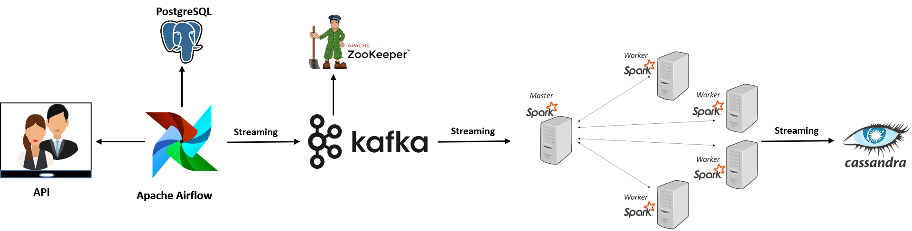

# Data Pipeline Project

This project involves fetching data from an API, processing it with Airflow, streaming it through Kafka and Apache Zookeeper, processing with Apache Spark, and finally storing it in Cassandra.




## Project Directory Structure

```
data-pipeline-project/
│
├── airflow/
│   ├── dags/
│   │   ├── api_to_postgres_dag.py
│   │   └── kafka_streaming_dag.py
│   ├── scripts/
│   │   ├── fetch_data.py
│   │   └── push_to_kafka.py
│   ├── Dockerfile
│   ├── requirements.txt
│   └── airflow.cfg
│
├── kafka/
│   ├── docker-compose.yml
│   ├── kafka_producer.py
│   ├── kafka_consumer.py
│   └── zookeeper.properties
│
├── spark/
│   ├── docker-compose.yml
│   ├── spark_submit.sh
│   ├── spark_processing.py
│   └── spark_conf/
│       ├── spark-defaults.conf
│       └── log4j.properties
│
├── cassandra/
│   ├── docker-compose.yml
│   ├── cassandra_init.cql
│   └── cassandra_config/
│       ├── cassandra.yaml
│       └── logback.xml
│
├── scripts/
│   ├── api_request.py
│   ├── data_transform.py
│   ├── load_to_postgres.py
│   └── load_to_cassandra.py
│
└── README.md
```

## Project Setup

### 1. Airflow Setup

1. Navigate to the `airflow` directory:
    ```bash
    cd data-pipeline-project/airflow
    ```

2. Build and start the Airflow containers:
    ```bash
    docker-compose up --build
    ```

3. Access the Airflow web UI at `http://localhost:8080` and ensure the DAGs are correctly displayed.

### 2. Kafka and Zookeeper Setup

1. Navigate to the `kafka` directory:
    ```bash
    cd data-pipeline-project/kafka
    ```

2. Start the Kafka and Zookeeper services:
    ```bash
    docker-compose up
    ```

3. Ensure Kafka and Zookeeper are running correctly.

### 3. Spark Setup

1. Navigate to the `spark` directory:
    ```bash
    cd data-pipeline-project/spark
    ```

2. Start the Spark master and worker containers:
    ```bash
    docker-compose up
    ```

3. Use `spark_submit.sh` to submit Spark jobs.

### 4. Cassandra Setup

1. Navigate to the `cassandra` directory:
    ```bash
    cd data-pipeline-project/cassandra
    ```

2. Start the Cassandra container:
    ```bash
    docker-compose up
    ```

3. Initialize the Cassandra schema:
    ```bash
    docker exec -it cassandra cqlsh -f /cassandra_init.cql
    ```

## Running the Pipeline

1. **API to PostgreSQL**:
    - This part is handled by Airflow. The DAG `api_to_postgres_dag.py` fetches data from the API and loads it into PostgreSQL.

2. **PostgreSQL to Kafka**:
    - Use the `push_to_kafka.py` script in the Airflow DAG `kafka_streaming_dag.py` to stream data from PostgreSQL to Kafka.

3. **Kafka to Spark**:
    - The `spark_processing.py` script consumes data from Kafka, processes it with Spark, and prepares it for storage in Cassandra.

4. **Spark to Cassandra**:
    - Finally, the processed data is loaded into Cassandra using the `load_to_cassandra.py` script.

## Scripts Overview

### `airflow/scripts/fetch_data.py`
Fetch data from the API and store it in PostgreSQL.

### `airflow/scripts/push_to_kafka.py`
Read data from PostgreSQL and push it to Kafka.

### `kafka/kafka_producer.py`
Custom Kafka producer script.

### `kafka/kafka_consumer.py`
Custom Kafka consumer script.

### `spark/spark_processing.py`
Process data using Spark.

### `scripts/api_request.py`
Script for making API requests.

### `scripts/data_transform.py`
Script for data transformation.

### `scripts/load_to_postgres.py`
Script for loading data into PostgreSQL.

### `scripts/load_to_cassandra.py`
Script for loading data into Cassandra.

## Dependencies

- Docker
- Docker Compose
- Apache Airflow
- Apache Kafka
- Apache Zookeeper
- Apache Spark
- Apache Cassandra
- PostgreSQL


# Reference
https://www.youtube.com/watch?v=GqAcTrqKcrY&t=326s