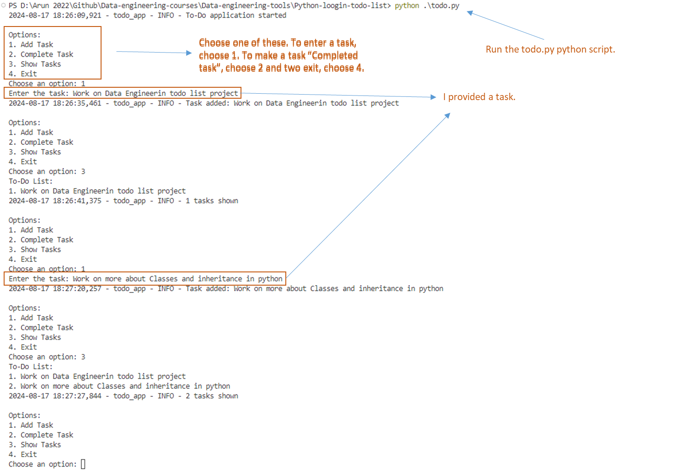
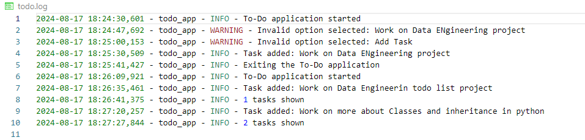

# **To-Do List Application**

A simple command-line To-Do List application built in Python, with integrated logging to track user actions and application behavior.

## **Features**
- Add tasks to your to-do list.
- Mark tasks as completed.
- View all pending tasks.
- Logging of user actions and errors.

## **Project Structure**

```plaintext
todo_app/
│
├── todo.py           # Main application file
├── logger.py         # Logging configuration file
└── todo.log          # Log file (generated after running the application)
```

## **Setup and Installation**

1. **Clone the Repository**
   ```bash
   git clone https://github.com/arunp77/Data-engineering-tools.git
   cd Python-loogin-todo-list/
   ```

2. **Run the Application**
   ```bash
   python todo.py
   ```
    

    

## **How to Use**

1. **Add Task:**  
   Choose the option to add a task and enter the task description.

2. **Complete Task:**  
   Select the task number to mark it as completed.

3. **Show Tasks:**  
   Display the list of current tasks.

4. **Exit:**  
   Exit the application.

## **Logging**

Logs are stored in `todo.log`, recording:
- Application start and stop.
- Tasks added, completed, and displayed.
- Errors like invalid task indices or options.

## **Contributing**

Feel free to fork the project and submit pull requests. For major changes, please open an issue first to discuss what you would like to change.

## **License**

This project is open-source and available under the MIT License.