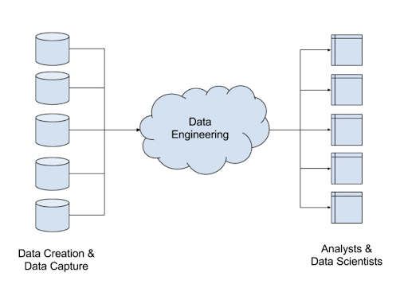

# About this Repository

Welcome to my Data Engineering Toolbox repository! Here, you'll find a collection of fundamentals for various tools used in data engineering. This repository is aimed at providing resources, tutorials, and examples to help you learn and understand these tools.

- [Database & Datapipelines](https://github.com/arunp77/Database-datapipeline-ETL)
- [SQL](https://github.com/arunp77/SQL)
- [FastApi-MCQ Generator](Fastapi)
- [Flask](Flask)
- [Elasticsearch](elasticsearch)
- [Docker](Docker)
- [Kafka-Streaming](Kafka-streaming)
- [Pyspark](pyspark)
- [Web-scrapping](https://github.com/arunp77/web-scrapping)
- [Github Actions](https://github.com/arunp77/github_actions)
- [Bash-scripting](https://github.com/arunp77/bash-scripting)
- [Version control: Git & GitHub](https://github.com/arunp77/Learning-git)

## Future Plans

I plan to continuously update this repository with more tools, tutorials, and projects related to data engineering. Stay tuned for exciting updates!

Feel free to explore, contribute, and learn. Happy coding!

# Data Engineering

Data engineering is a field within data science that focuses on designing, building, and maintaining the infrastructure and systems necessary for processing and analyzing large volumes of data. Data engineers play a crucial role in creating data pipelines, ensuring data quality, and optimizing data workflows to support various data-driven applications and analytics.

Here are some main tools commonly used in data engineering:

1. **Databases:** Databases are used to store, retrieve, and manage structured or unstructured data. Examples include relational databases like PostgreSQL, MySQL, and SQL Server, as well as NoSQL databases like MongoDB, Cassandra, and Redis.

2. **ETL (Extract, Transform, Load) Tools:** ETL tools are used to extract data from various sources, transform it into a usable format, and load it into a target database or data warehouse. Popular ETL tools include Apache NiFi, Apache Airflow, Talend, and Informatica.

3. **Data Warehouses:** Data warehouses are central repositories that store large volumes of structured data from various sources. They are optimized for querying and analysis and support decision-making processes. Examples include Amazon Redshift, Google BigQuery, Snowflake, and Microsoft Azure Synapse Analytics.

4. **Big Data Processing Frameworks:** Big data processing frameworks are used to process and analyze large datasets distributed across clusters of computers. Popular frameworks include Apache Hadoop (with tools like HDFS, MapReduce, and Hive), Apache Spark, Apache Flink, and Apache Kafka.

5. **Data Integration Tools:** Data integration tools facilitate the integration of data from multiple sources, including databases, APIs, and streaming platforms. Examples include Apache Kafka, Apache Nifi, and MuleSoft.

6. **Data Visualization Tools:** Data visualization tools are used to create visual representations of data to facilitate data exploration, analysis, and decision-making. Examples include Tableau, Power BI, and Looker.

7. **Version Control Systems:** Version control systems like Git are essential for managing changes to code, scripts, configurations, and other artifacts used in data engineering projects. They enable collaboration, code review, and tracking of changes over time.

8. **Containerization and Orchestration Tools:** Containerization tools like Docker and container orchestration platforms like Kubernetes are used to deploy, manage, and scale data engineering applications and microservices in a distributed environment.

9. **Scripting and Programming Languages:** Scripting and programming languages like Python, Java, Scala, and SQL are widely used in data engineering for writing ETL scripts, data processing algorithms, and analytics queries.

10. **Monitoring and Logging Tools:** Monitoring and logging tools are used to monitor the health, performance, and reliability of data pipelines, infrastructure, and applications. Examples include Prometheus, Grafana, ELK Stack (Elasticsearch, Logstash, Kibana), and Splunk.

These tools, among others, form the foundation of data engineering workflows and enable organizations to ingest, process, analyze, and derive insights from data at scale.

