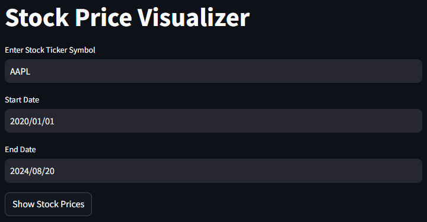
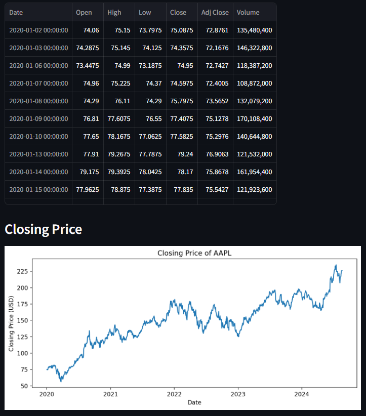

# Stock Price Visualizer

This is a simple web application built using [Streamlit](https://streamlit.io/) that allows users to visualize historical stock prices for a given stock ticker symbol. Users can enter a stock ticker, select a date range, and view the stock's closing prices plotted on a chart.

## Features

- **Interactive User Input**: Enter a stock ticker symbol and choose a date range.
- **Data Fetching**: Fetches historical stock price data from Yahoo Finance using the `yfinance` library.
- **Data Visualization**: Displays the closing prices of the selected stock over the specified date range using Matplotlib.

## Installation

### Prerequisites

- Python 3.7 or above
- `pip` package manager

### Step 1: Clone the Repository

```bash
git clone https://github.com/arunp77/Data-engineering-tools.git
cd Streamlit-Stock-Price-Visualizer/
```

### Step 2: Install Dependencies

Install the required Python packages:

```bash
pip install streamlit yfinance matplotlib
```

## Usage

### Running the Application

To run the application, use the following command:

```bash
streamlit run stock_app.py
```

This will start a local web server and open the app in your default web browser. You can then interact with the app by entering a stock ticker symbol (e.g., `AAPL` for Apple) and selecting a date range to view the stock's historical prices.

### Example

1. Enter a stock ticker symbol (e.g., `AAPL`).
2. Choose a start date and an end date.
3. Click the "Show Stock Prices" button.
4. The app will display a table with the stock's historical data and plot the closing prices on a chart.

## Project Structure

```
├── stock_app.py       # Main application file
└── README.md          # Project documentation
```

## Dependencies

- **Streamlit**: A fast way to build and share data apps.
- **yfinance**: A Python wrapper for the Yahoo Finance API.
- **Matplotlib**: A plotting library used for visualizing data.

## Enhancements

This basic version of the Stock Price Visualizer can be enhanced by:

- Adding more charts, such as open prices, high/low prices, and trading volume.
- Implementing additional features like moving averages, Bollinger Bands, and other technical indicators.
- Allowing users to select different chart types (e.g., line, bar, candlestick).

## License

This project is licensed under the MIT License - see the [LICENSE](LICENSE) file for details.

## Acknowledgments

- [Streamlit](https://streamlit.io/) for making data apps so easy to build.
- [Yahoo Finance](https://finance.yahoo.com/) for providing stock market data.

---

This `README.md` provides a clear overview of the project, how to set it up, and how to use it. Adjust the content as needed, especially the repository link and any specific customization you make to the project.





