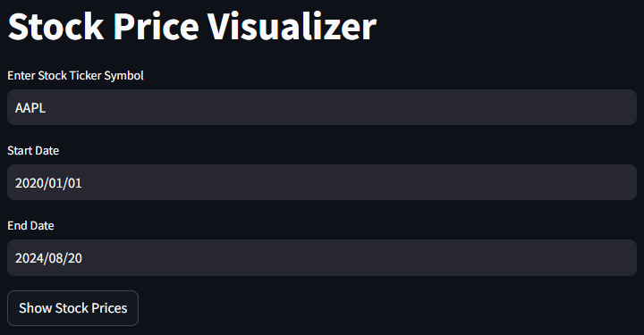
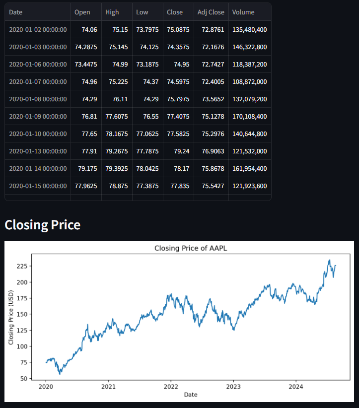
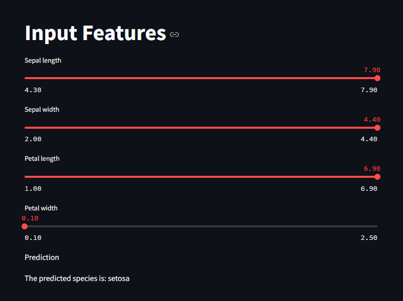
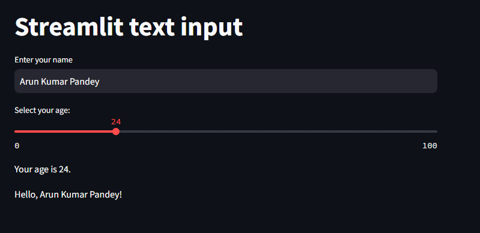

# Data Science Web Apps with Streamlit

This repository contains three interactive web applications built using [Streamlit](https://streamlit.io/). Each application focuses on different data science problems: stock market visualization, iris species prediction, and widget data analysis.

## Projects Overview

### 1. Stock Market Visualizer

A web application that allows users to visualize historical stock prices for a given stock ticker symbol. Users can input a stock ticker, select a date range, and view the stock's closing prices on a chart.

- **Features**:
  - Input for stock ticker and date range.
  - Fetches data from Yahoo Finance using the `yfinance` library.
  - Visualizes closing prices with Matplotlib.

- **File**: `stock_app.py`

### 2. Iris Species Predictor

An application that predicts the species of an iris flower based on user input of its physical features. It uses a pre-trained RandomForestClassifier model on the famous Iris dataset.

- **Features**:
  - Sliders to input sepal length, sepal width, petal length, and petal width.
  - Predicts the species of the iris flower based on the input features.
  - Displays the predicted species.

- **File**: `iris_app.py`

### 3. Widget Data Analyzer

This application allows users to analyze and visualize data related to widgets. It includes functionality to load data, display basic statistics, and visualize trends.

- **Features**:
  - File upload for widget data in CSV format.
  - Displays data summary and basic statistics.
  - Visualization of data trends using line charts and bar charts.

- **File**: `widget_app.py`

## Installation

### Prerequisites

- Python 3.7 or above
- `pip` package manager

### Step 1: Clone the Repository

```bash
git clone https://github.com/arunp77/Data-engineering-tools.git
cd /Streamlit-web-application
```

### Step 2: Install Dependencies

Install the required Python packages:

```bash
pip install -r requirements.txt
```

You can create a `requirements.txt` file with the following content:

```txt
streamlit
yfinance
scikit-learn
pandas
matplotlib
```

## Usage

### Running the Applications

You can run each application separately by navigating to the project directory and using the following command:

#### Stock Market Visualizer

```bash
streamlit run stock_app.py
```





#### Iris Species Predictor

```bash
streamlit run iris_app.py
```



#### Widget Data Analyzer

```bash
streamlit run widget_app.py
```



This will start a local web server and open the corresponding app in your default web browser. You can then interact with the app based on its specific functionality.

## Project Structure

```
├── stock_app.py        # Stock Market Visualizer
├── classification.py   # Iris Species Predictor
├── widgets.py       # Widget Data Analyzer
├── requirements.txt    # Python dependencies
└── README.md           # Project documentation
```

## Dependencies

- **Streamlit**: A fast way to build and share data apps.
- **yfinance**: A Python wrapper for the Yahoo Finance API (used in the Stock Market Visualizer).
- **scikit-learn**: A machine learning library (used in the Iris Species Predictor).
- **Pandas**: A data manipulation library.
- **Matplotlib**: A plotting library for creating static visualizations.

## Enhancements

Here are some potential enhancements for each app:

- **Stock Market Visualizer**:
  - Add more chart types (e.g., candlestick charts).
  - Implement technical indicators like moving averages, RSI, etc.

- **Iris Species Predictor**:
  - Add more sophisticated models or allow users to select between different models.
  - Visualize decision boundaries of the model.

- **Widget Data Analyzer**:
  - Add advanced analytics like trend analysis or anomaly detection.
  - Implement user-defined filters to refine data visualization.

## License

This project is licensed under the MIT License - see the [LICENSE](LICENSE) file for details.

## Acknowledgments

- [Streamlit](https://streamlit.io/) for making data apps easy to build.
- [Yahoo Finance](https://finance.yahoo.com/) for providing stock market data.
- [scikit-learn](https://scikit-learn.org/) for its machine learning tools and datasets.

