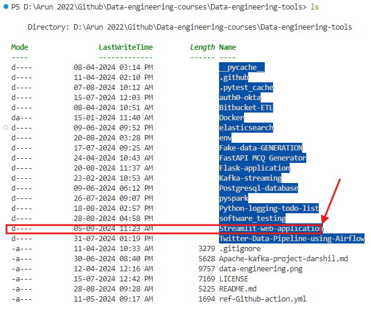
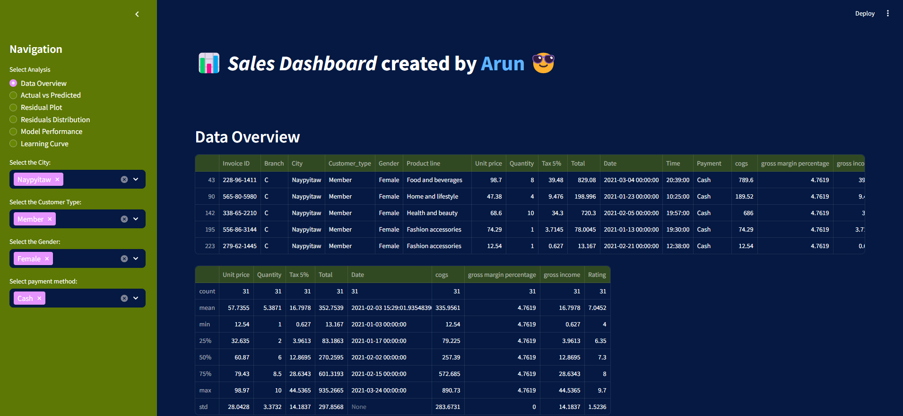

# Interactive Dashboard with Python – Streamlit 

Sales Dashboard built-in Python and the Streamlit library to visualize Excel data.

**The dashboard is available at streamlit:** https://supermarket-salesdashboard.streamlit.app/

## Access the code

1. To download the code, fork the repo:
    ```bash 
    git clone https://github.com/arunp77/Data-engineering-tools.git 
    ```
2. Navigate to the `streamlit` folder and run the code using Streamlit: 

    

    ```bash 
    cd .\Streamlit-web-application\supermarkt_sales\ 
    ``` 
3. Next run the `setup.py` file using:

    ```bash
    streamlit run setup.py
    ```
    You can quit the terminal using:
    ```bash 
    # quit
    ctrl-c
    ```

     


## Video

Available on my youtube channel:

<div style="border: 1px solid white; padding: 10px;">
  <a href="https://www.youtube.com/watch?v=pqi1fY-l4AY" target="_blank">
    
  </a>
</div>


# Reference 
- https://github.com/arunp77/Data-engineering-tools/tree/main/Streamlit-web-application/supermarkt_sales