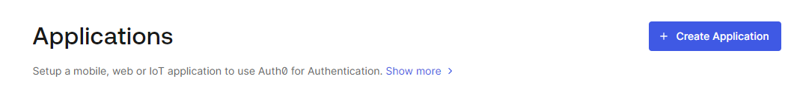
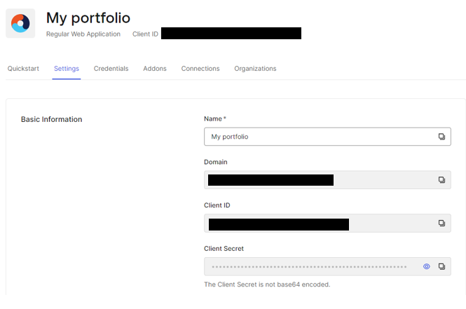

# Auth0 flask application

This project is a Flask web application that demonstrates authentication using Auth0. It provides a simple interface for users to log in, view their profile information, and log out.

## Features

- User authentication with Auth0
- Display of user profile information
- Secure session management
- Docker support for easy deployment

## Prerequisites

Before you begin, ensure you have met the following requirements:

- Python 3.x installed
- Docker installed (for containerized deployment)
- An Auth0 account and application set up

## Installation

1. Clone this repository:
   ```
   git clone https://github.com/arunp77/Data-engineering-tools
   cd auth0-flask-app
   ```

2. Create a virtual environment and activate it:
   ```
   python -m venv env
   source env/bin/activate  # On Windows use `env\Scripts\activate`
   ```

3. Install the required dependencies:
   ```
   pip install -r requirements.txt
   ```

4. Set up your environment variables:
   Create a `.env` file in the root directory and add the following:
   ```
   AUTH0_CLIENT_ID=your_auth0_client_id
   AUTH0_CLIENT_SECRET=your_auth0_client_secret
   AUTH0_DOMAIN=your_auth0_domain
   APP_SECRET_KEY=your_app_secret_key
   ```
> ### Create Autho0 account
> Create a free account in Auth0
> - Go to [Auth0](https://auth0.com/) and click Sign Up.
> - Use Google, GitHub or Microsoft Account to login.
> - Next create a application, for which, you will get the secrets.
> 
> The created application setting page has all the secrets.
> 


## Usage

To run the application locally:

```
python server.py
```

The application will be available at `http://localhost:3000`.

## Docker Deployment

### Docker Container Setup

This section describes how to build, tag, and push the Docker image for this project to Docker Hub.

#### Prerequisites

- Docker installed on your local machine
- Docker Hub account

#### Dockerfile

The Dockerfile used for this project:

```dockerfile
FROM python:3

WORKDIR /home/app

# If we add the requirements and install dependencies first, Docker can use cache if requirements don't change
ADD requirements.txt /home/app
RUN pip install --no-cache-dir -r requirements.txt

ADD . /home/app
CMD python server.py

EXPOSE 3000
```

#### Steps to Build and Push the Docker Image
1. **Build the Docker Image:**
   Navigate to the directory containing your `Dockerfile` and run:
   ```bash
   docker build -t arunp77/auth0-flask-app .
   ```

2. **Login to Docker Hub:**
   ```bash
   docker login
   ```
   You will be prompted to enter your Docker Hub username and password.

3. **Tag the Docker Image:**
   Tag your image for versioning (optional but recommended):
   ```bash
   docker tag arunp77/auth0-flask-app arunp77/auth0-flask-app:latest
   ```

4. **Push the Docker Image to Docker Hub:**
   ```bash
   docker push arunp77/auth0-flask-app:latest
   ```

   Replace `latest` with your specific tag if you've used a different one.

### Accessing the Docker Hub Repository

The Docker image is available at: [https://hub.docker.com/repository/docker/arunp77/auth0-flask-app/general](https://hub.docker.com/repository/docker/arunp77/auth0-flask-app/general)


## Project Structure

```
auth0-flask-app/
├── server.py
├── requirements.txt
├── .env
├── Dockerfile
├── README.md
└── templates/
    └── home.html
```

## Contributing

Contributions to this project are welcome. Please fork the repository and submit a pull request with your changes.

## License

[GNU General Public License v3.0](Licence)

## Contact

If you have any questions or feedback, please contact me at [arunp77@gmail.com](arunp77@gmail.com).