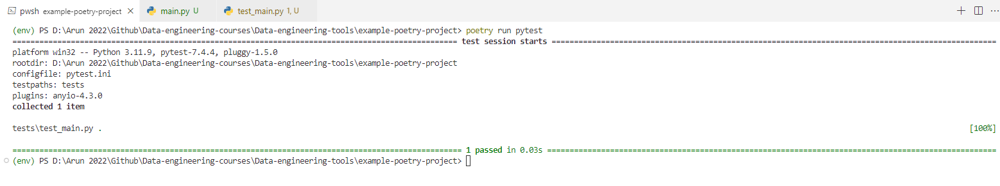

### Project Structure:
This project demonstrates how to structure a Python project using **Poetry** for dependency management, testing with **pytest**, and organizing the source code and tests using a `src/` directory structure.
```
example-poetry-project/
├── poetry.lock               # Auto-generated by Poetry; contains dependencies and their versions
├── pyproject.toml            # Configuration file for Poetry and the project
├── pytest.ini                # Pytest configuration file
├── README.md                 # Project description and usage instructions
├── src/
│   └── my_project/
│       ├── __init__.py       # Marks the directory as a Python package
│       └── main.py           # Main Python script with the core functionality
└── tests/
    └── test_main.py          # Unit tests for the project
```

### Step-by-Step Setup

1. **Create Project Folder:**
   ```bash
   mkdir example-poetry-project
   cd example-poetry-project
   ```

2. **Initialize Poetry Project:**
   The `pyproject.toml` is the main configuration file for this project, managed by Poetry. It defines project metadata, dependencies, and build instructions.

   Inside the project directory, run:
   ```bash
   poetry init
   ```
   Follow the prompts to set up the project:
   - Project name: `my_project`
   - Version: `0.1.0`
   - Description: `Example project using Poetry`
   - License: `MIT` (or any other)
   - Add dependencies (leave empty for now).

   ```
   [tool.poetry]
   name = "hello-world"
   version = "0.1.0"
   description = "Just to showcase how the poetry library works"
   authors = ["Arun Kumar Pandey <arunp77@gmail.com>"]
   license = "MIT"
   readme = "README.md"

   [tool.poetry.dependencies]
   python = "^3.11"

   [tool.poetry.dev-dependencies]
   pytest = "^7.0.1"

   [build-system]
   requires = ["poetry-core"]
   build-backend = "poetry.core.masonry.api"

   [tool.poetry.scripts]
   my_project = "my_project.main:hello_world"
   ```

   This configuration file is the core of the project setup.
   
   --------------------------------------
   - **Project Metadata**: The `[tool.poetry]` section contains details like the project name, version, description, and author.
   - **Dependencies**: The `[tool.poetry.dependencies]` and `[tool.poetry.dev-dependencies]` sections specify the packages needed for the project and development.
   - **Build System**: The `[build-system]` section defines the tools necessary for building the project.

   --------------------------------------
3. **Set Up Directory Structure:**
   Create the following directories:
   ```bash
   mkdir -p src/my_project
   mkdir tests
   ```

4. **Create Python Files:**
   - **src/my_project/main.py**: The `src/` directory contains the main project source code. By placing your code in a `src/` directory, you prevent certain issues, such as accidentally importing the project source code during tests. It also keeps a clean separation between the codebase and the tests.

     ```python
     # src/my_project/__init__.py
     def hello_world():
         return "Hello, World!"

     if __name__ == "__main__":
         print(hello_world())
     ```

   - **`__init__.py` file:** The `__init__.py` file is important for making Python treat a directory as a **package**. This allows you to import files and functions from within that directory. By importing `hello_world` in `__init__.py`, we can simplify imports across the project.
     - **Empty `__init__.py`**: If no specific behavior is needed, you can leave `__init__.py` empty.
     - **Imports in `__init__.py`**: You can include import statements inside this file to expose certain functions or classes at the package level.
      ```python
      # src/my_project/__init__.py
      from .main import hello_world
      ```

      This allows you to import `hello_world` as:

      ```python
      from my_project import hello_world
      ```

     Now, instead of importing `hello_world` from `main.py`, we can import it directly from `my_project`:

      ```python
      from my_project import hello_world
      ```

   - **tests/test_main.py**: The `tests/` directory contains the unit tests for your project. In this example, we have `test_main.py`, which tests the functionality in `main.py`.
     ```python
     # tests/test_main.py
     from my_project.main import hello_world

     def test_hello_world():
         assert hello_world() == "Hello, World!"
     ```
     This test checks whether the `hello_world` function returns the expected output.


5. **Create `pytest.ini`:** 
   The `pytest.ini` file configures the behavior of **pytest**, the testing framework. It specifies where to look for source code and ensures that pytest works well with the `src/` directory layout.
   ```ini
   # pytest.ini
   [pytest]
   pythonpath = src
   ```
   This tells pytest to treat `src` as part of the module search path, allowing tests to import from the `my_project` package without any issues.

6. `poetry.lock`

   This file is **auto-generated** by Poetry when you run `poetry install`. It locks the specific versions of the dependencies used in the project. You don't need to edit this file manually.

7. **Install Dependencies:**
   Now that we’ve set up our dependencies and dev tools (like `pytest`), install them by running:

   ```bash
   poetry install
   ```

7. **Running the Project:**
   You can run your script using Poetry’s environment:
   ```bash
   poetry run python src/my_project/main.py
   ```

8. **Running Tests:** 
   To run tests, use:
   ```bash
   poetry run pytest
   ```
   

9.  **Add Dependencies:**
   To add dependencies to your project, use:
   ```bash
   poetry add <package-name>
   ```
   Example:
   ```bash
   poetry add requests
   ```

10. **Activate Virtual Environment:**
    If you want to use the virtual environment manually:
    ```bash
    poetry shell
    ```

### Next Steps:
- You can extend this project with additional modules or dependencies.
- Add more scripts, packages, or unit tests to structure it further.
